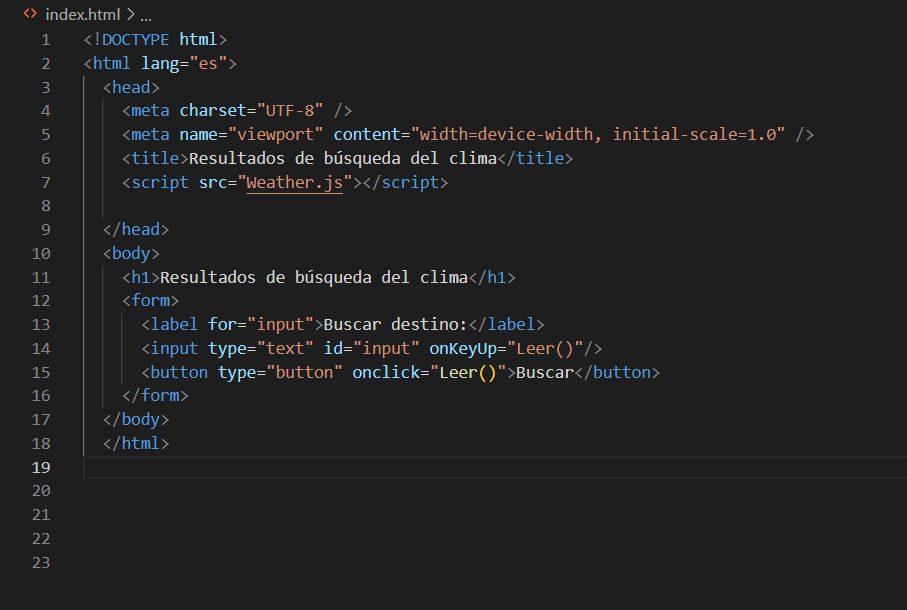

#    Tecnológico Nacional de México
#   Instituto Tecnológico de Tijuana
#        Subdirección Académica
# Departamento de Sistemas y Computación
##  Ingeniería en Sistemas Computacionales
##        PROGRAMACION WEB 
## Osman Argueta Garcia 19210463
##
##   Profesora: Daniela Sanchez
##     Semestre ENE - FEB 2023
## 
##  ---------------------------------------
## CODIGO EN JAVASCRIPT 
async function Leer() {

    const buscar = document.getElementById("buscar").value;
    const ciudad = document.getElementById("ciudad").value;
    const claveApi = '36120d40b9a052a2c79b616c2928765b';

    const options = {
        method: 'GET',
        headers: {
            'appid': claveApi,
        }
    };

    fetch(`https://api.openweathermap.org/data/2.5/weather?q=${ciudad}`, options)
    .then(resultado => resultado.json())
        .then(resultado=>{
            console.log(resultado);

            const {name, main={}} = resultado;
            
            console.log(name, main.temp);
            document.getElementById("lista").innerHTML='';

            const temperatura = main.temp - 273.15;

            document.getElementById("lista").innerHTML+=`

                    <h1>Ciudad: ${name}</h1>
                    <h3>Temperatura: ${temperatura.toFixed(2)}°C</h3>
            
`;
      });
}
##  ---------------------------------------
## CODIGO EN HTML

